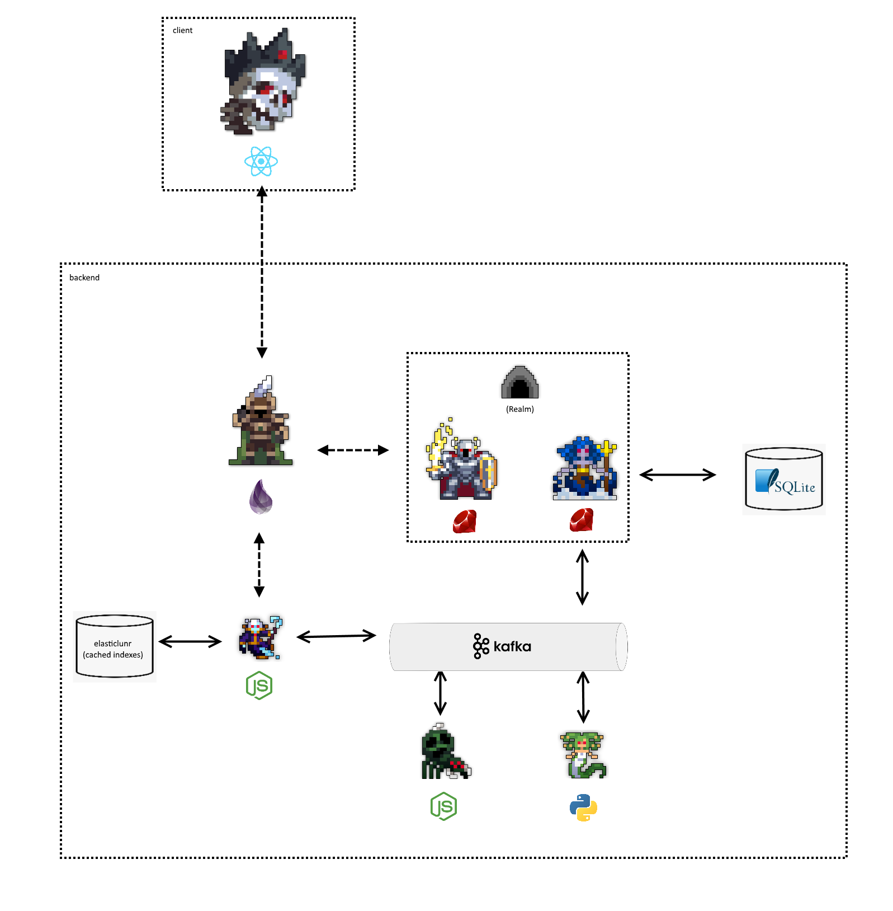

# COMP 4601 - A1

Hello, and welcome to my implementation of Assignment 1 for the Fall 2021 iteration COMP 4601.



# Services

As you can see, from the architecture diagram above, this project makes use of several different services instead of being one monolithic application. Each of the services in this application is named after a different boss from the video game [Realm of the Mad God](https://www.realmofthemadgod.com/).

<hr>

## [Avatar](https://www.realmeye.com/wiki/avatar-of-the-forgotten-king) - Client


Avatar is the React frontend client.

In Realm of the Mad God, the Avatar of the Forgotten King drops a portal to the "Shatters" dungeon. In this application, "Avatar" is a "portal" to this applications backend.

<hr>

## [Sentinel](https://www.realmeye.com/wiki/the-bridge-sentinel) - Gateway Service


Sentinel is the gateway service.

In Realm of the Mad God, the Bridge Sentinel is accessed by opening a bridge or a "Gateway" to it's boss room. In this application, "Sentinel" acts as a gateway service and acts as the public facing api. Sentinel essentially is the api that meets all the requirements of the assignment. Sentinel is written in elixir and is tightly coupled to Septavius (search service) and Oryx (data service).

**Endpoints:**

- GET `/fruits?q=<query>&limit=<limit>&boost=<boost>`
- GET `/personal?q=<query>&limit=<limit>&boost=<boost>`
- GET `/pages/:id`

<hr>

## [Septavius](https://www.realmeye.com/wiki/septavius-the-ghost-god) - Search Service


Septavius is the search service.

In Realm of the Mad God, Septavius lives in a dungeon that often requires you to search quite hard for the exit. In this application, "Septavius" is responsible for performing searches and returning the ids of records that match the query. Septavius is written in JavaScript and uses the Elasticlunr library. It is tightly coupled to Sentinel, but communicates with other searches with kafka.

**Endpoints:**

- GET `/search/<crawl_id>?q=<query>&limit=<limit>&boost=<boost>`

<hr>

## [Oryx](https://www.realmeye.com/wiki/oryx-the-mad-god-3) - Data Service


Oryx is the data service.

In Realm of the Mad God, Oryx is the entity that oversees "the realm". "Realm" is the name of the Ruby on Rails application that houses the "Oryx" service webserver. Oryx is the data service and has an api for retrieving records from it's SQLite database.

**Endpoints:**

- GET `/pages/<id>`
- GET `/crawls/<crawl_id>/pages?ids=<ids_string>`

<hr>

## [Thessal](https://www.realmeye.com/wiki/thessal-the-mermaid-goddess) - Orchestration Service


Thessal is the orchestration service.

In Realm of the Mad God, Thessal is one of the only enemies that talks to the player (it consumes the player's messages). In this appliation, Thessal acts as the "Realm" app's core kafka consumer. It consumes just about every kafka event and orchestrates there procceeding follow up events.


<hr>

## [Arachna](https://www.realmeye.com/wiki/son-of-arachna) - Crawling Service


Arachna is the crawling service.

In Realm of the Mad God, Arachna is a spider themed boss. In this application, Arachna is responsible for crawling web pages and returning their results through kafka. Arachna is written in JavaScript and uses the Crawler library.

<hr>

## [Medusa](https://www.realmeye.com/wiki/medusa) - Pank Rank Service


Medusa is the page rank service.

This service is name Medusa because it is written in Python. Medusa is responsible for calculating the page rank of each page in a crawl. Medusa commnicates with the other services through kafka.

<hr>

# Setup

1. Run Kafka docker-compose

```bash
docker-compose up
```

2. Run Oryx

```bash
cd realm
bundle install
rails db:setup

rails s
```

3. Run Thessel

```bash
cd realm
bundle install
rails db:setup

bundle exec racecar Thessal
```

4. Run Arachna

```bash
cd arachna
npm install

npm run dev
```

4. Run Septavius

```bash
cd septavius
npm install

npm run dev
```

5. Run Medusa
```bash
cd medusa
virtualenv venv -p python3
source venv/bin/activate
pip install -r requirements.txt

python application.py
```

6. Run Sentinel
```bash
cd sentinel
mix deps.get

mix run --no-halt
```

7. Run Avatar
```bash
cd avatar
yarn install

yarn start
```


# Kafka Topics

- page-crawl-enqueue
- page-crawl-complete
- index_data_request
- index_data_request_pagerank
- index_data_request_pagerank_complete
- index_data_request_complete

# Scripts

Create message
```bash
bash create-message.sh {topic name}
```

Create topic
```bash
bash create-topic.sh {topic name}
```
